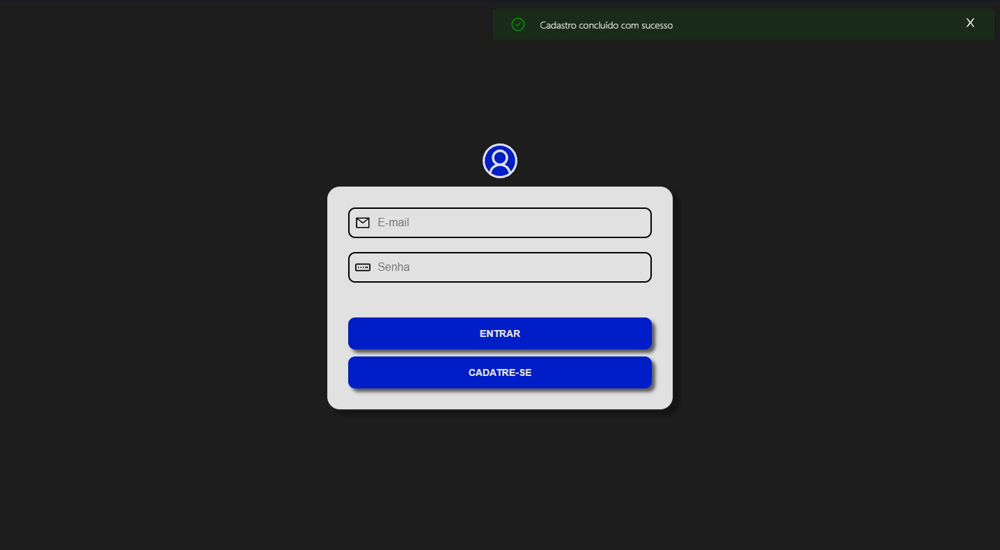
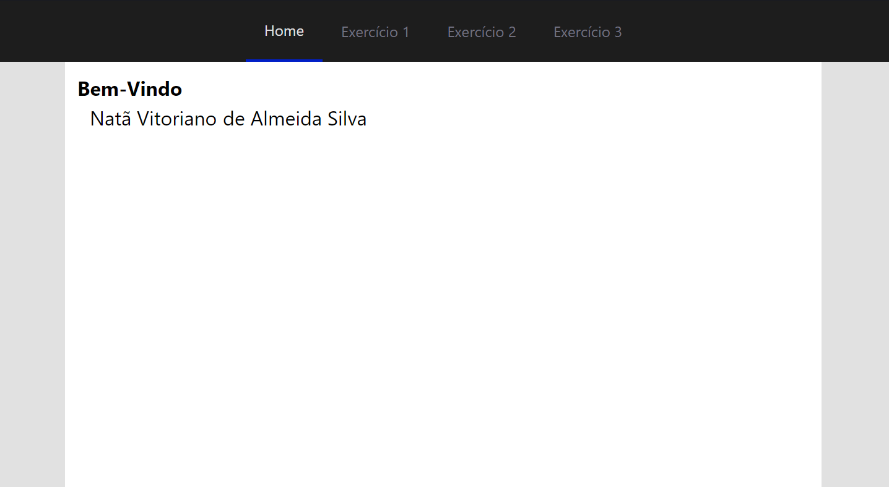
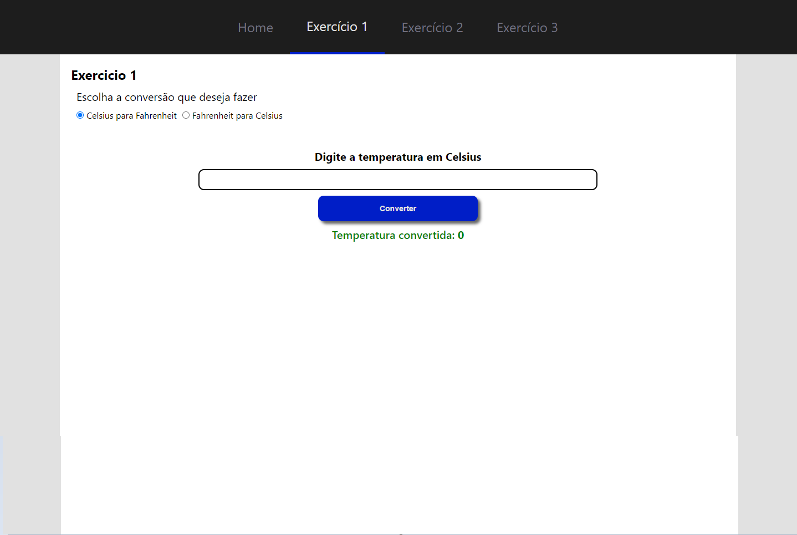
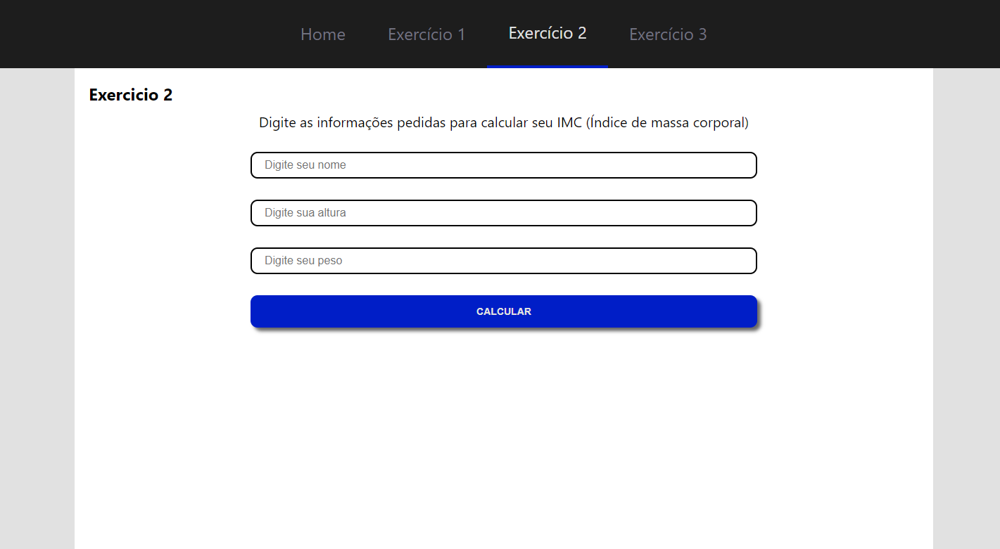
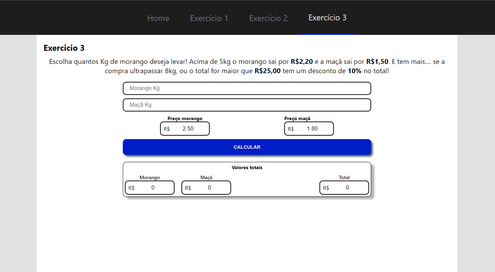

# Teste de programação
> Página web com 3 exercícios feita para treinamento.

## Indice
1. [Lista de tarefas](#lista)
2. [Imagens do projeto](#imagens)
3. [Como rodar a aplicação](#comoRodar)
    3.1. [Back-end](#back)
    3.2. [Front-end](#front)
4. [Tecnologias utilizadas](#tecnologias)

### 1. Lista de tarefas

- [x] ~~Página de login~~
- [x] ~~Página de cadastro~~
- [x] ~~Validações de campos~~
- [x] ~~Exercício 1~~
- [x] ~~Exercício 2~~
- [x] ~~Exercício 3~~
- [ ] Validar token JWT corretamente

### 2. Imagens do projeto

Página de Login

Página inicial.

Exercício 1 converte a temperatura de celsius para fahrenheit e vice-versa.

Exercício 2 Calcula o IMC.

Exercício 3 calculo de compra e descontos baseado na compra de morangos e maçãs.

### 3. Como rodar a aplicação ✅

É importante que possua o **MongoDB** e **Node.js** instalados!

#### 3.1. Back-end
- Verifique se o **MongoDB** está em execução.
- **`npm i`** para instalar depencencias.
- rodar **node src/index.js**
- pronto

#### 3.2. Front-end
- **`npm i`** para instalar depencencias.
- **`npm start`**

- Na pasta raiz digite o comando "npm i" para instalar todas as dependências do projeto.
- Ainda na pasta raiz e acesse em seu terminal a pasta src(cd src).
- Acesse a pasta service(cd service) e rode o comando "node app.js" para startar a API para consumo de dados do deezer.
- Abra outro terminal, e na pasta raiz do projeto rode o comando "npm start" para que o Webapp abra.

### 4. Tecnologias utilizadas

As seguintes ferramentas foram utilizadas na construção do projeto:

- [Node.js](https://nodejs.org/en/)
- [React](https://pt-br.reactjs.org/)
- [Redux](https://redux.js.org/)
- [Styled-Components](https://styled-components.com/)
- [MongoDB](https://www.mongodb.com/pt-br)

